## 博主开发的其他博客或论坛项目全部在这里
**[https://liuyanzhao.com/shop.html?k=博客](https://liuyanzhao.com/shop.html?k=博客)**    
**[https://liuyanzhao.com/shop.html?k=论坛](https://liuyanzhao.com/shop.html?k=论坛)**  
- -------------------------------------------------------------------------------
- 基于SpringBoot/SSM的极为轻量级推荐博客系统
- 最新消息 赠送2小时讲解视频
- 预览地址：[http://recommendedblog.liuyanzhao.com](http://recommendedblog.liuyanzhao.com)
- 详细介绍地址：[https://liuyanzhao.com/shop/recommendedblog.html](https://liuyanzhao.com/shop/recommendedblog.html)
- 代码地址：https://github.com/saysky/recommendedblog 或 https://gitee.com/saysky/recommendedblog

# 一、功能介绍
- 用户注册、登录、找回密码
- 文章管理
- 分类管理
- 标签管理
- 用户管理
- 评论管理
- 用户未登录根据文章访问量推荐
- 用户登录后根据用户喜好推荐
- 系统分用户和管理员2个角色

该博客是极为轻量级博客，代码十分清晰简单

# 二、技术组成
- 1、SpringBoot 或 SSM
- 2、MyBatis
- 3、Thymeleaf
- 4、Bootstrap
- 5、MySQL

# 三、项目截图
1-首页1.png

2-首页2.png
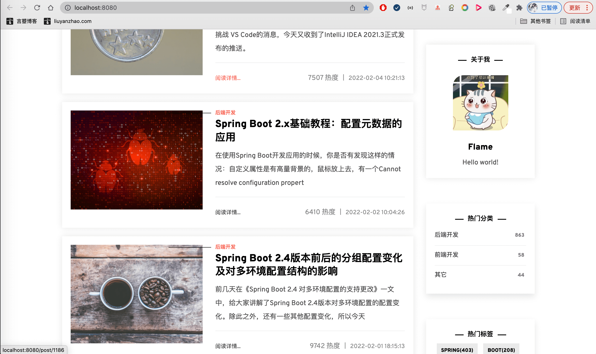
3-首页3.png
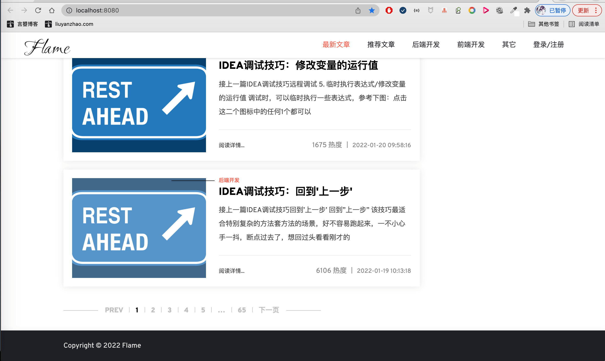
4-推荐文章.png

5-指定分类的文章.png

6-指定标签的文章.png
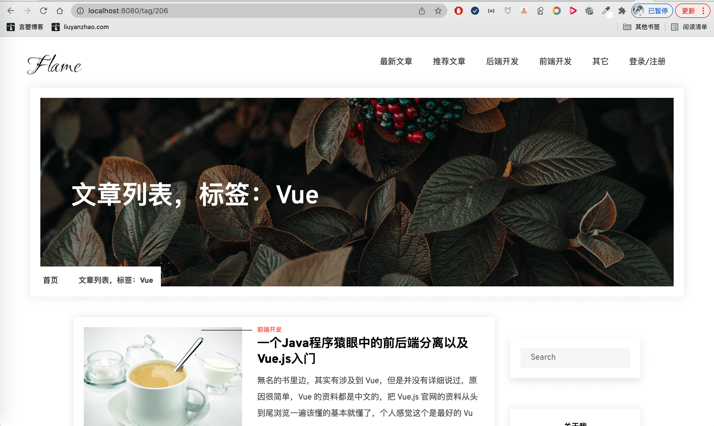
7-文章详情1.png

8-文章详情2.png
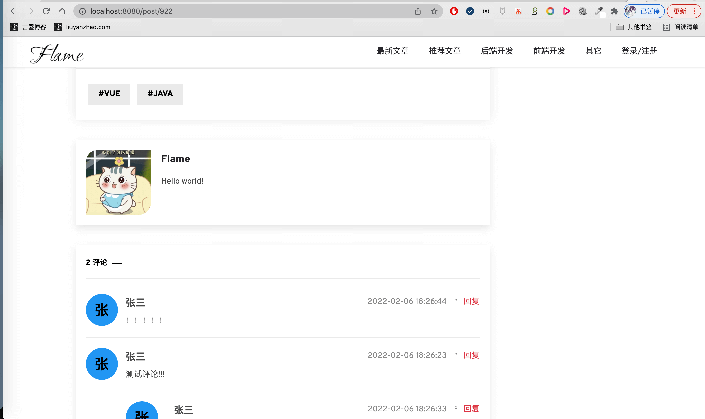
9-文章详情3.png

10-登录.png
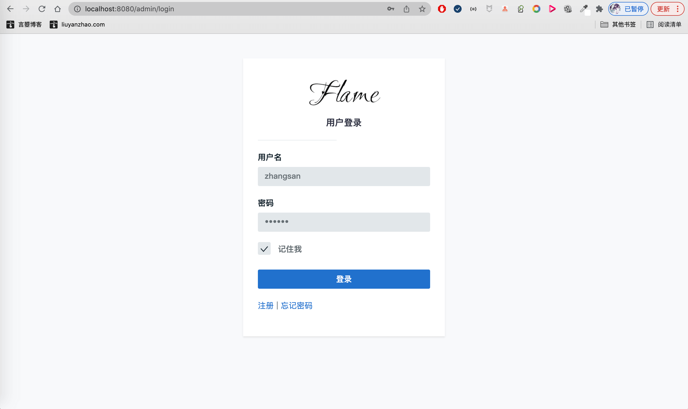
11-注册.png

12-找回密码.png
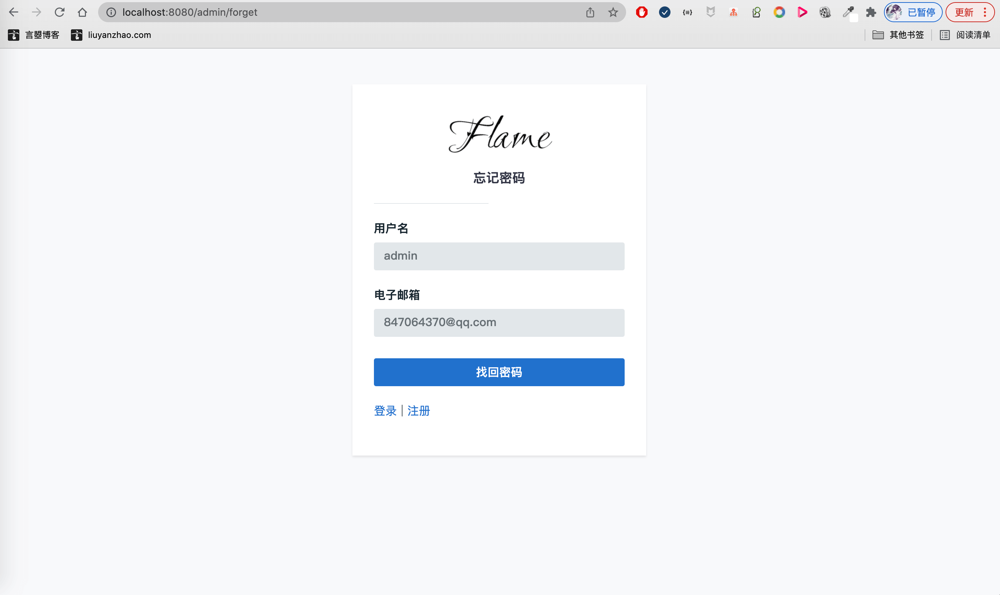
13-文章管理.png

14-文章编辑1.png
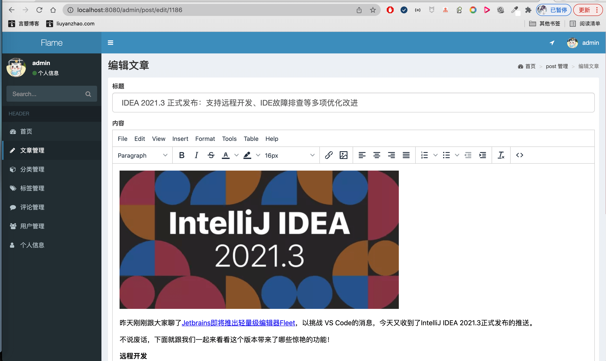
15-文章编辑2.png
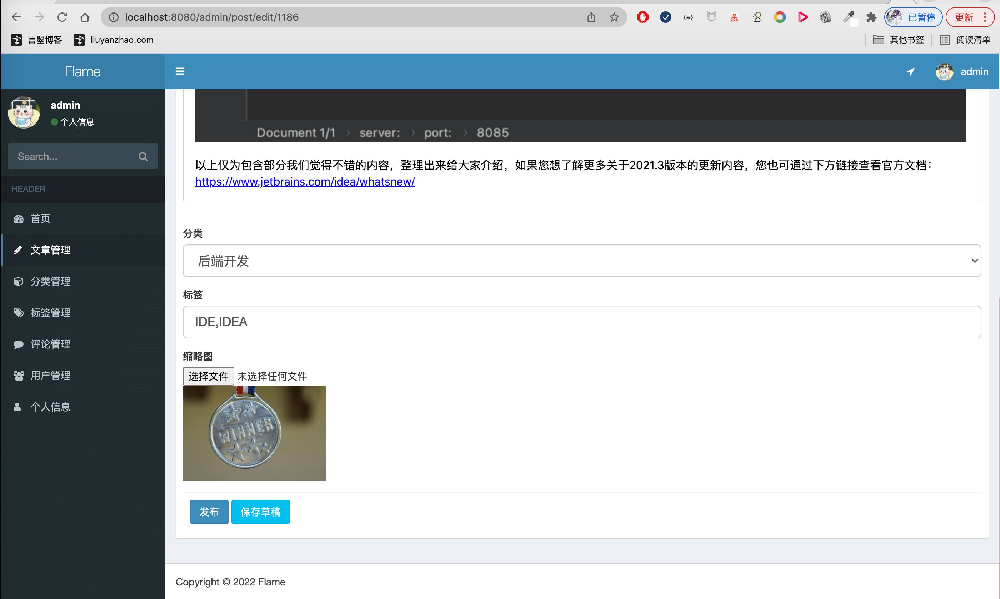
16-分类管理.png
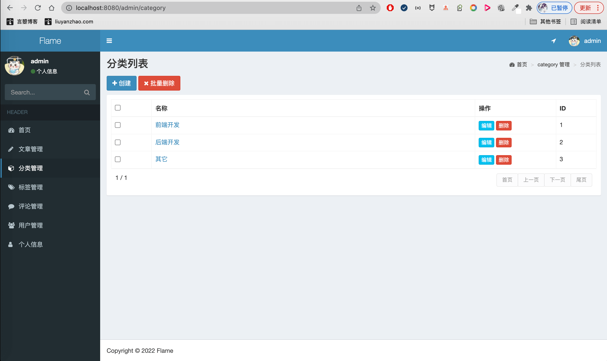
17-标签管理.png
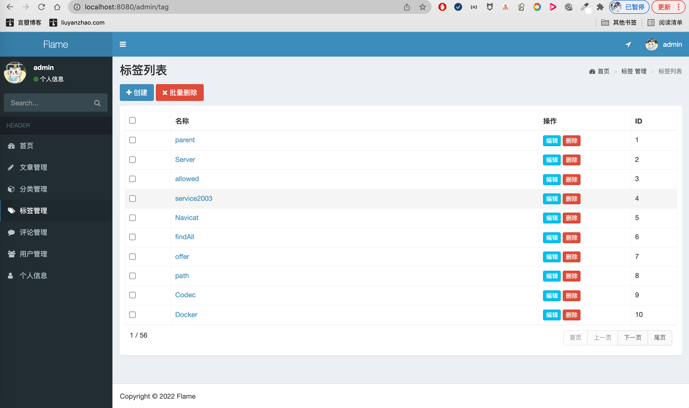
18-评论管理.png
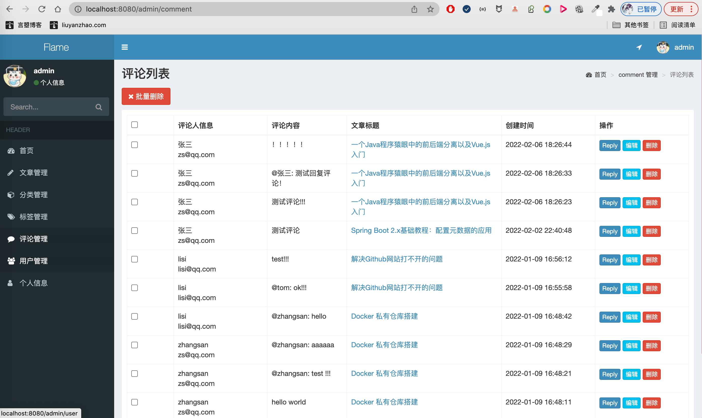
19-用户管理.png

20-个人信息.png
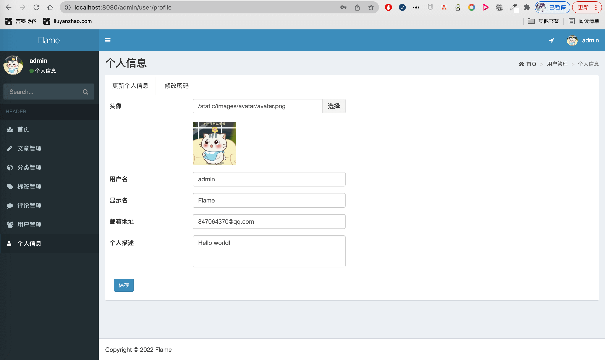
21-普通用户文章列表.png

22-普通用户评论列表.png

# 四、联系方式
需要完整代码联系博主，微信847064370

